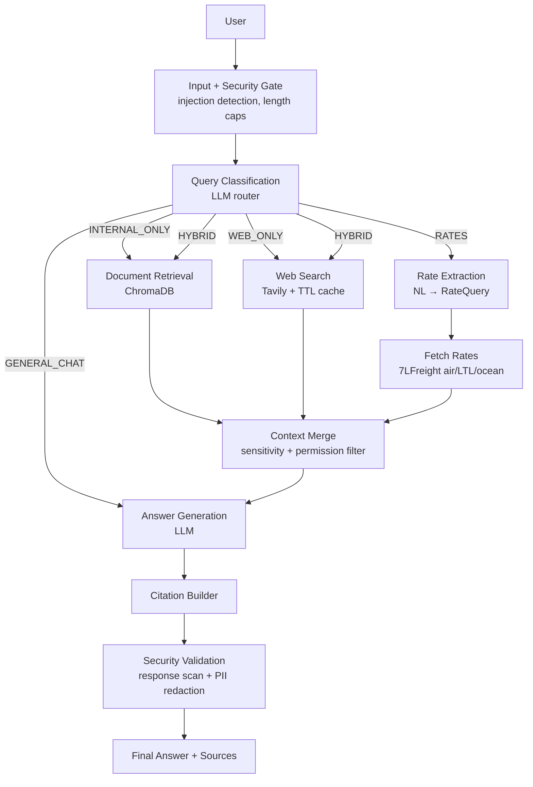

# Hybrid RAG AI Agent — Architecture

## Overview

An enterprise Hybrid RAG system that answers logistics and general-knowledge
questions by combining three knowledge sources — internal documents (ChromaDB),
external web search (Tavily), and LLM reasoning — behind a five-layer security
stack that prevents leakage of confidential company information.

## Module map

| Package | Responsibility |
|---|---|
| `app/config` | Pydantic settings tree; every tunable is env-overridable (`LLM__MODEL=...`) |
| `app/utils` | Structured logging (structlog), latency timers, exception hierarchy |
| `app/loaders` | Format-specific document loaders (PDF, DOCX, TXT, MD, CSV, XLSX, PPTX, HTML, JSON) + chunking + metadata extraction |
| `app/embeddings` | Provider factory: OpenAI / Voyage / Cohere / Sentence Transformers |
| `app/database` | ChromaDB manager: `documents` + `web_cache` collections, persistence, rebuild |
| `app/retrievers` | Similarity / MMR search, metadata filtering, contextual compression, cross-encoder reranking |
| `app/routers` | LLM query classifier → `INTERNAL_ONLY` / `WEB_ONLY` / `HYBRID` / `GENERAL_CHAT` / `RATES` |
| `app/search` | `SearchProvider` interface; Tavily implementation; dedup + ranking |
| `app/rates` | `RateProvider` interface; 7LFreight client (air / LTL / ocean) with JWT caching; NL→query extraction; sort + cap + TTL caching |
| `app/cache` | TTL cache for web content and rate quotes (never permanent) |
| `app/security` | Layer 1 injection detection · Layer 2 sensitive-doc detection · Layer 3 permission validation · Layer 4 response scanning · Layer 5 PII detection |
| `app/chains` | Prompt templates, answer-generation chain, citation builder |
| `app/graph` | LangGraph state machine wiring all nodes |
| `app/agents` | High-level facade consumed by API and UI |
| `app/api` | FastAPI: `/chat`, `/upload`, `/reindex`, `/search`, `/rates`, `/health`, `/cache` |
| `frontend/` | Streamlit dark-theme chat UI |
| `tests/` | Unit tests (mocked externals) + integration tests |

## Design principles

- **Dependency injection** — components receive their collaborators (settings,
  vector store, providers) via constructors; nothing reaches for globals except
  the cached `get_settings()` accessor.
- **Interfaces first** — embeddings, web search, and LLMs sit behind small
  abstract interfaces so providers can be swapped through configuration alone.
- **Retrieved content is data, never instructions** — documents and webpages
  are wrapped in delimited data blocks; the system prompt explicitly forbids
  executing instructions found inside them (indirect-injection defense).
- **Fail closed** — if a security layer errors, the request is refused, not
  allowed through.
- **Observability** — every pipeline stage logs structured latency,
  counts, and cache-hit metrics.

## Build status

All components are implemented and tested:

1. ✅ Foundation — skeleton, settings, logging, exceptions
2. ✅ Ingestion — loaders, chunking, metadata
3. ✅ Embeddings + ChromaDB
4. ✅ Retrieval pipeline
5. ✅ Web search + TTL cache
6. ✅ Security layers (see [security.md](security.md))
7. ✅ LangGraph workflow + query router
8. ✅ FastAPI
9. ✅ Streamlit UI
10. ✅ CLI, tests & documentation
